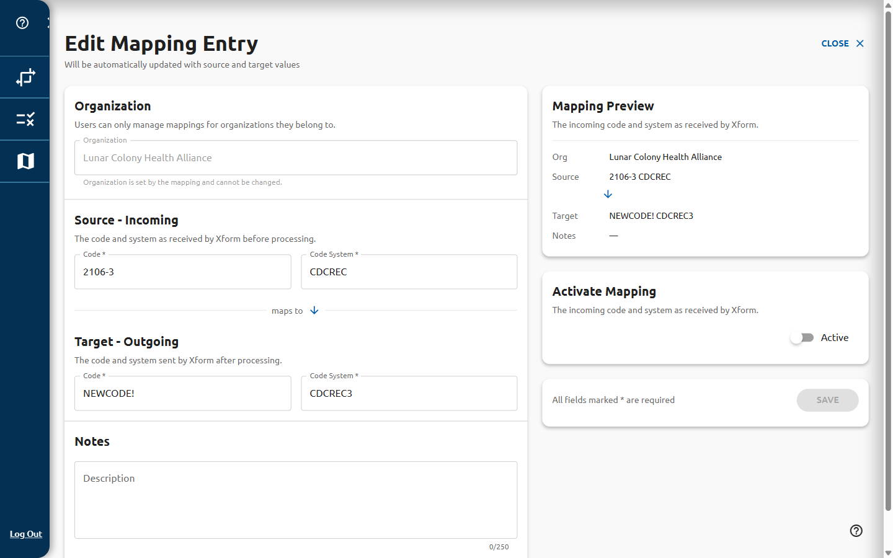

# Create or Edit a Mapping

The mapping form is used both to create a new mapping and to edit an existing one.
When editing, the **ID / UUID** field is pre-populated and read-only.

## Mapping Info Fields

All fields except **ID / UUID** are required.

| Field | Description |
|---|---|
| **ID / UUID** | System-assigned unique identifier. Read-only; cannot be changed. |
| **Organization Name** | The organization that owns this mapping (e.g., `General Hospital IIS`). |
| **Source Code System** | The code system the incoming value originates from (e.g., `http://hl7.org/fhir/v2/0003`). |
| **Source Code** | The specific source code to match (e.g., `ADT_A01`). |
| **Target Code System** | The code system the value maps to (e.g., `http://hl7.org/fhir/ValueSet/v3-ActCode`). |
| **Target Code** | The resulting code after translation (e.g., `IMP`). |
| **Is this mapping active?** | Toggle switch. Active mappings are applied during pipeline execution; inactive mappings are ignored. |

## Creating a New Mapping

1. On the [Mappings list](index.md), click **Add New Mapping**.
2. Leave the **ID / UUID** field blank (it will be assigned on save).
3. Fill in all required fields.
4. Set the **Active** toggle to the desired initial state (defaults to **Active**).
5. Click **Save** (or the equivalent submit button on the form).

## Editing an Existing Mapping

1. On the [Mappings list](index.md), click the edit icon in the **ACTION** column for
   the mapping you want to change.
2. The form opens with all fields pre-populated.
3. Modify any editable field.
4. To disable the mapping without deleting it, flip the **Active** toggle to **Inactive**.
5. Click **Save** to apply your changes.

## Disabling a Mapping

Set the **Active** toggle to **Inactive** and save. The mapping remains in the system
and appears in the list with a **Not Active** status badge, but it will not be applied
during pipeline execution.
