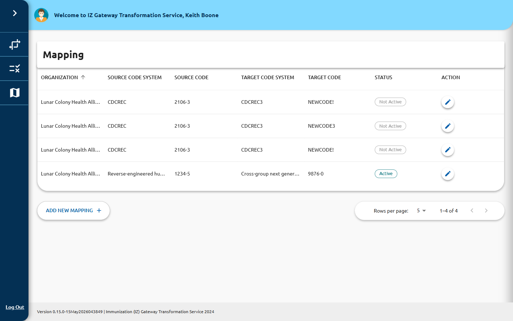

# Mappings

The **Mapping** page (`/mapping`) lists all code mappings configured in the system.
A mapping defines how a code value in one code system translates to a code value in
another — for example, mapping a source HL7 event code to its FHIR equivalent.

## Mappings List

The list is displayed as a data grid with the following columns:

| Column | Description |
|---|---|
| **ORGANIZATION** | The organization that owns this mapping |
| **SOURCE CODE SYSTEM** | The code system the incoming value comes from |
| **SOURCE CODE** | The specific code to match |
| **TARGET CODE SYSTEM** | The code system the value maps to |
| **TARGET CODE** | The resulting code after translation |
| **STATUS** | **Active** (teal badge) or **Not Active** (grey badge) |
| **ACTION** | Edit button (pencil icon) |

## Searching and Filtering

A **Quick Filter** search box appears in the toolbar at the top right of the grid.
Type any text to filter the list across all visible columns in real time.

You can also sort by any column by clicking its header. Click once for ascending,
again for descending.

## Adding a New Mapping

Click **Add New Mapping** (bottom-left of the grid) to open the mapping creation form.
See [Create or Edit a Mapping](create-edit.md) for details.

## Editing a Mapping

Click the **edit** (pencil) icon in the **ACTION** column for any row to open the
mapping edit form. The mapping's ID/UUID is pre-filled and cannot be changed.

## Highlighted Rows

Rows highlighted in red indicate that the mapping has an active maintenance window.
These mappings may behave differently during the maintenance period.

## Pagination

Use the page-size selector and navigation arrows at the bottom right of the grid to
page through large numbers of mappings. Available page sizes: 5, 25, 50, 100.
