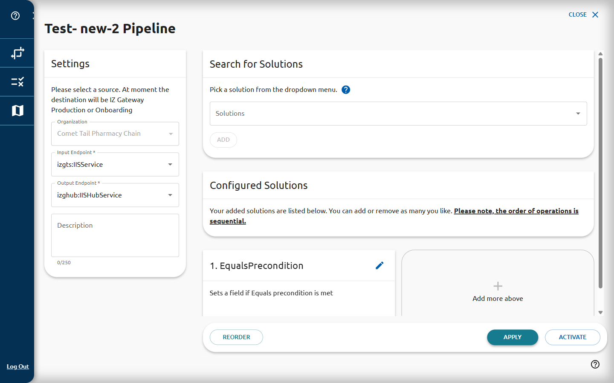
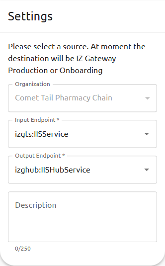

# Create or Edit a Pipeline

The pipeline form is a multi-step form with three sections:

1. **Pipeline Info** — name, description, and organization
2. **Endpoints** — inbound and outbound service endpoints
3. **Solutions** — the transformation solutions assigned to this pipeline

Each section shows a numbered circle that turns into a green check mark once it is
complete.

## Step 1: Pipeline Info

| Field | Required | Description |
|---|---|---|
| **Pipeline Name** | Yes | A short, descriptive name (e.g., `ADT-to-FHIR-IIS-Production`) |
| **Description** | No | A plain-text description (max 250 characters) |
| **Organization** | Yes | The organization that owns this pipeline; select from the dropdown |

## Step 2: Endpoints

| Field | Required | Description |
|---|---|---|
| **Inbound Endpoint** | Yes | Where messages enter; select one of the configured IIS endpoints |
| **Outbound Endpoint** | Yes | Where transformed messages are sent; select the IZ Gateway destination |

**Inbound endpoint options:**
- `izgts:IISHubService`
- `izgts:IISService`

**Outbound endpoint options:**
- `izghub:IISHubService`
- `iis:IISService`

## Step 3: Solutions

Assign one or more solutions to the pipeline. Solutions are applied to messages in the
order they are listed.

1. Click **Add Solution** (or the equivalent button in the solutions section).
2. Select a solution from the list of available solutions.
3. Repeat to add additional solutions.
4. Drag or reorder solutions if order matters for your use case.

> **Prerequisite:** Solutions must already exist. See
> [Solutions Creator](../solutions/index.md) to create a solution first.

## Preconditions

Optionally configure preconditions that must be met before the pipeline processes a
message. See [Preconditions in Pipelines](preconditions.md) for details.

## Creating a New Pipeline

1. On the [Pipelines list](index.md), click **Add New Pipeline**.
2. Complete all three steps.
3. Click **Save** (or the equivalent submit button) to create the pipeline.
4. New pipelines are created in the **Active** state by default.

## Editing an Existing Pipeline

1. On the [Pipelines list](index.md), click the edit icon in the **ACTION** column.
2. Modify fields in any section.
3. Add, remove, or reorder solutions as needed.
4. Click **Save** to apply your changes.
