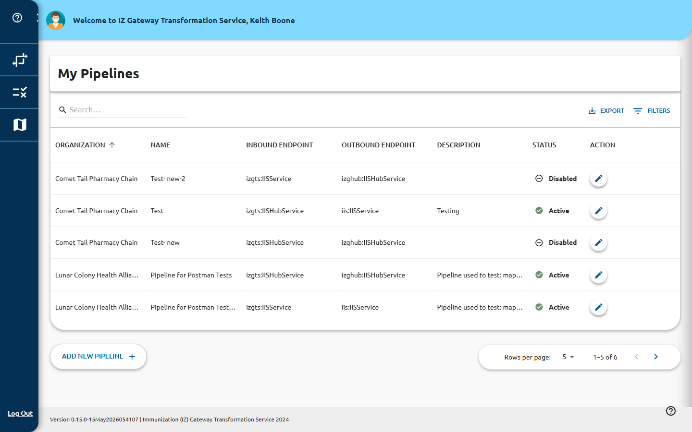

# Pipelines

The **Manage Pipelines** page (`/manage`) lists all message-transformation pipelines
configured in the system. A pipeline connects an inbound endpoint to an outbound
endpoint and applies one or more solutions to messages as they transit.

## Pipelines List

The list is displayed as a data grid with the following columns:

| Column | Description |
|---|---|
| **ORGANIZATION** | The organization that owns this pipeline |
| **NAME** | The pipeline's human-readable name |
| **INBOUND ENDPOINT** | Where messages enter the pipeline |
| **OUTBOUND ENDPOINT** | Where transformed messages are sent |
| **DESCRIPTION** | A brief description of the pipeline's purpose |
| **STATUS** | Active (green circle) or Disabled (grey circle) with a toggle |
| **ACTION** | Edit button (pencil icon) |

## Searching and Filtering

Use the **Quick Filter** search box (top right of the toolbar) to filter the list in
real time across all columns.

## Enabling or Disabling a Pipeline

Click the status icon in the **STATUS** column to toggle a pipeline between **Active**
and **Disabled** without opening the edit form. The change is applied immediately.

> **Caution:** Disabling an active pipeline will stop message processing for that
> pipeline. Confirm with your team before disabling a production pipeline.

## Adding a New Pipeline

Click **Add New Pipeline** (bottom-left of the grid) to open the pipeline creation
wizard. See [Create or Edit a Pipeline](create-edit.md) for details.

> **Prerequisite:** At least one [solution](../solutions/index.md) must exist before
> you can complete pipeline creation, as you must assign a solution to the pipeline.

## Editing a Pipeline

Click the edit icon in the **ACTION** column for a row to open the pipeline edit form.

## Highlighted Rows

Rows highlighted in red indicate an active maintenance window for that pipeline.

## Pagination

Use the page-size selector and navigation arrows (bottom right) to browse large pipeline
lists. Available page sizes: 5, 25, 50, 100.
