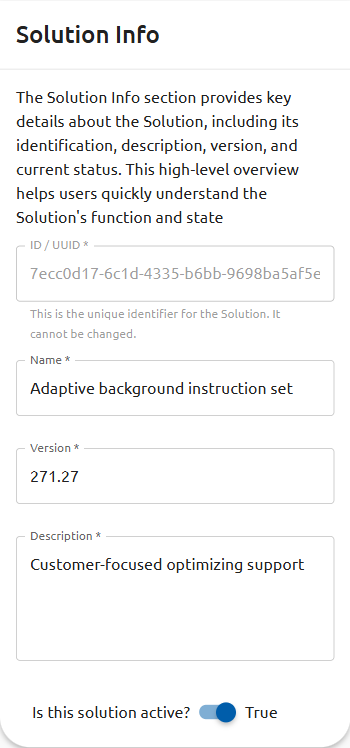

# Create or Edit a Solution

The solution form has two main sections: **Solution Info** (identity and metadata) and
**Operations** (the transformation steps to apply to messages).

## Solution Info Fields

| Field | Description |
|---|---|
| **ID / UUID** | System-assigned unique identifier. Read-only; cannot be changed. |
| **Name** | A short, descriptive name for the solution (e.g., `ADT-to-FHIR-v2`). Required. |
| **Version** | A version string (e.g., `1.0.0`). Required. Useful for tracking changes over time. |
| **Description** | A plain-text description of what the solution does. Required. Shown in the solutions list. |
| **Is this solution active?** | Toggle switch. Active solutions are available for pipeline assignment. |

## Creating a New Solution

1. On the [Solutions list](index.md), click **Add Solution**.
2. Fill in all required fields in **Solution Info**.
3. Add operations as needed (see [Operations](operations.md)).
4. Click **Save** (or the equivalent submit button).

## Editing an Existing Solution

1. On the [Solutions list](index.md), click the edit icon in the **ACTION(S)** column.
2. Modify any editable field.
3. Add, remove, or reorder operations as needed.
4. Click **Save** to apply your changes.

## Operations

See [Configuring Operations](operations.md) for a full guide to adding transformation
steps to a solution.

## Request vs. Response

When creating or editing a solution, operations are split across two tabs:

- **Request** — operations applied to incoming request messages before they are forwarded
  to the outbound endpoint. Use this tab to transform, route, or enrich inbound data.
- **Response** — operations applied to response messages returned from the outbound
  endpoint before the response is sent back to the original sender.

Configure operations on both tabs as needed for your scenario.
