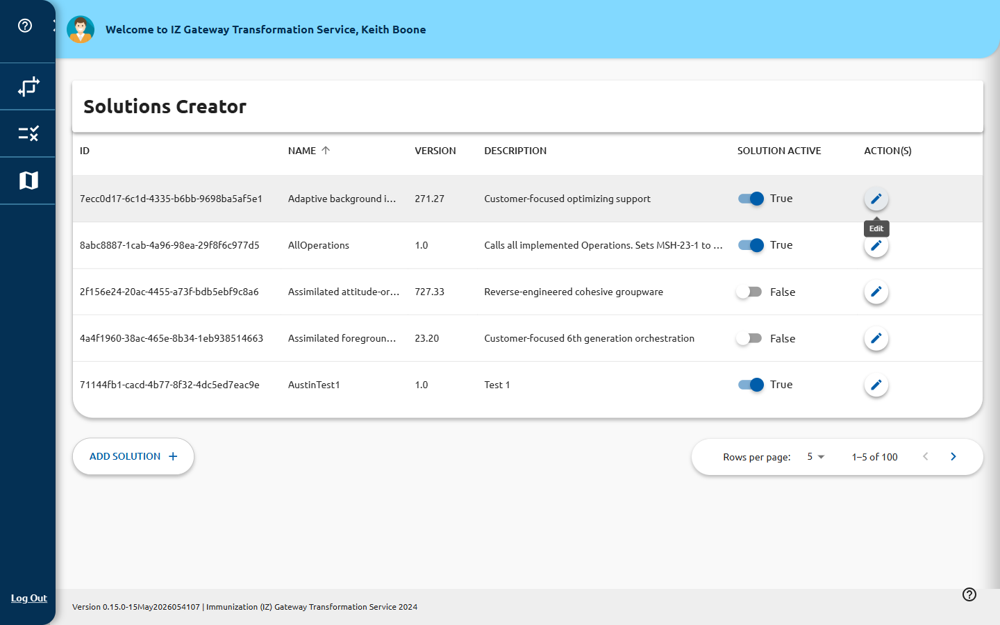

# Solutions

← [Navigation Help](../navigation.md)

The **Solutions Creator** page (`/solutions`) lists all transformation solutions
configured in the system. A solution defines the set of operations applied to messages
as they flow through a pipeline. Solutions must be created before they can be assigned
to a pipeline.

## Solutions List

The list is displayed as a data grid with the following columns:

| Column | Description |
|---|---|
| **ID** | The system-assigned UUID for the solution |
| **NAME** | The human-readable solution name |
| **VERSION** | The solution version string |
| **DESCRIPTION** | A brief description of what the solution does |
| **SOLUTION ACTIVE** | A toggle switch to enable or disable the solution inline |
| **ACTION(S)** | Edit button (pencil icon) |

## Searching and Filtering

Use the **Quick Filter** search box (top right of the toolbar) to filter the list
across all columns in real time.

## Enabling or Disabling a Solution

You can toggle a solution active or inactive directly from the list using the
**SOLUTION ACTIVE** switch in each row — no need to open the edit form. The change
is applied immediately.

> **Note:** Disabling a solution does not disable or remove any pipelines that use it,
> but those pipelines will not execute the disabled solution's operations.

## Adding a New Solution

Click **Add Solution** (bottom-left of the grid) to open the solution creation form.
See [Create or Edit a Solution](create-edit.md) for details.

## Editing a Solution

Click the edit icon in the **ACTION(S)** column for a row to open the solution edit
form.

## Relationship to Pipelines

Solutions must exist before a pipeline can reference them. If you are building a new
pipeline, create your solution first, then return to [Manage Pipelines](../pipelines/index.md)
to create or edit the pipeline.

## Highlighted Rows

Rows highlighted in red indicate an active maintenance window for that solution.

## Pagination

Use the page-size selector and navigation arrows (bottom right) to browse large
solution lists. Available page sizes: 5, 25, 50, 100.
